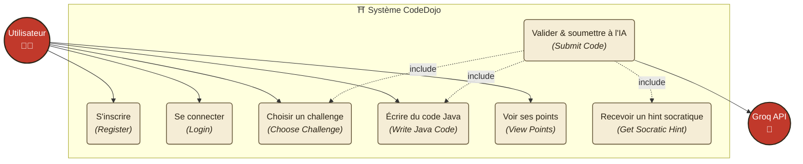
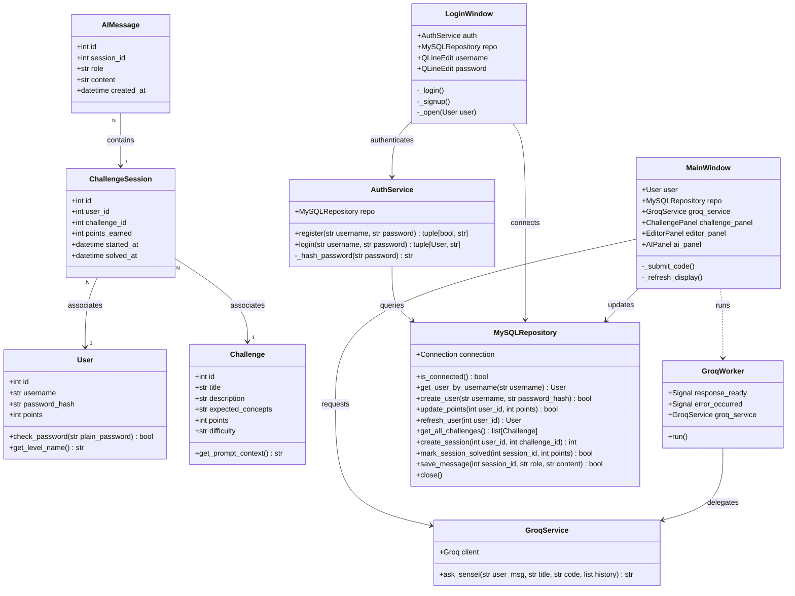
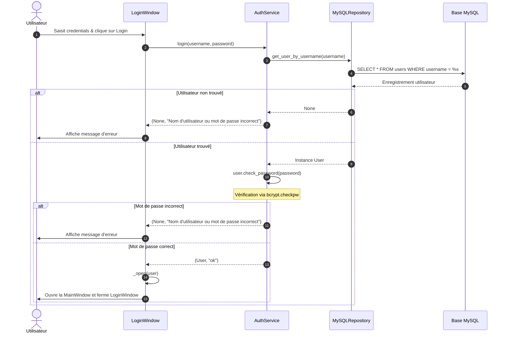
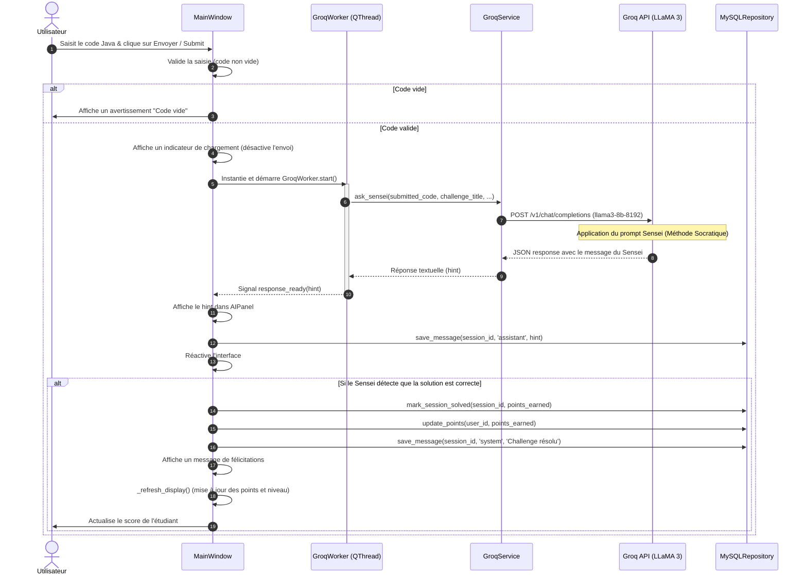

# ⛩️ CodeDojo - Diagrammes UML du Projet

Ce document présente l'ensemble de la conception technique du projet **CodeDojo** sous forme de diagrammes **UML** dynamiques générés avec **Mermaid**.

---

## 1. Diagramme des Cas d'Utilisation (Use Case Diagram)

Ce diagramme illustre les interactions des différents acteurs (l'Utilisateur/Élève et l'API externe Groq) avec les fonctionnalités du système.

---

## 2. Diagramme de Classes (Class Diagram)

Ce diagramme présente l'architecture logicielle du projet. Il illustre le découpage propre en couches respectant les principes de l'architecture d'entreprise :
- **Models/Entities** (Dataclasses métier)
- **Repository** (Accès aux données MySQL paramétré)
- **Services** (Logique d'authentification et appels asynchrones Groq)
- **UI (PySide6)** (Interface utilisateur avec design Dojo)

---

## 3. Diagramme de Séquence - Authentification (Sequence Diagram - Auth)

Ce diagramme montre le flux d'opérations lors de la connexion d'un utilisateur, en mettant en évidence la vérification sécurisée avec **bcrypt**.

---

## 4. Diagramme de Séquence - Soumission de Code (Sequence Diagram - Code Submission)

Ce diagramme montre le traitement complet lors de la soumission de code Java, du thread asynchrone (QThread) pour l'API Groq (llama-3-8b-8192) jusqu'à la mise à jour des points de l'étudiant.

